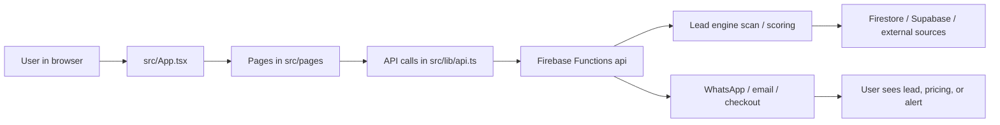

# Code Graph

## Purpose

Map the live JobFilter codebase as a simple Obsidian reference so the main moving parts stay visible while the product changes.

This is the working graph for the deployed app:

- React frontend in `src/`
- Firebase Functions API in `functions/`
- server-side routes and services in `server/`
- lead-engine logic in `functions/leadEngine/`
- shared types in `src/lib/types.ts` and `functions/leadEngine/types.ts`
- production build output in `dist/`

## Core Flow

## Main Surfaces

| Surface | Key files |
| --- | --- |
| Routing and app shell | `src/App.tsx`, `src/components/TopNav.tsx`, `src/components/Footer.tsx` |
| Free scan experience | `src/pages/FindJobsPage.tsx`, `src/components/LeadCard.tsx`, `src/components/TrustBadges.tsx` |
| Public trade briefing | `src/pages/NewsPage.tsx` |
| Pricing and conversion | `src/pages/PricingPage.tsx`, `src/components/CheckoutButton.tsx`, `src/components/WaitlistForm.tsx` |
| Product explanation | `src/pages/HomePage.tsx`, `src/pages/MethodologyPage.tsx`, `src/pages/BlueprintPage.tsx` |
| API layer | `functions/index.ts`, `server/app.ts`, `server/routes/*`, `server/services/*` |
| Lead engine | `functions/leadEngine/scan.ts`, `functions/leadEngine/scorer.ts`, `functions/leadEngine/types.ts` |
| Deployment | `firebase.json`, `dist/` |

## Dependencies To Watch

- `src/pages/FindJobsPage.tsx` depends on the lead response shape staying aligned with `src/lib/types.ts`.
- `functions/leadEngine/scan.ts` depends on the fetchers, source registry, and scorer returning the fields the UI expects.
- `functions/index.ts` must keep `/api/leads/search`, `/api/waitlist`, `/api/territories/summary`, and `/api/leads/notify` stable.
- `src/pages/PricingPage.tsx` depends on waitlist/contact flow and checkout flow staying in sync.

## Current Operating Rule

- Keep the public graph simple.
- Keep the lead engine explicit.
- Do not split shared types without updating both frontend and functions.
- If a change affects lead scoring, update the route, the UI, and the vault note together.

## Live Reference

- GitHub branch: `claude/admin-guard-paid-feature-GSg4U`
- Production site: `https://jobfilter.uk`
