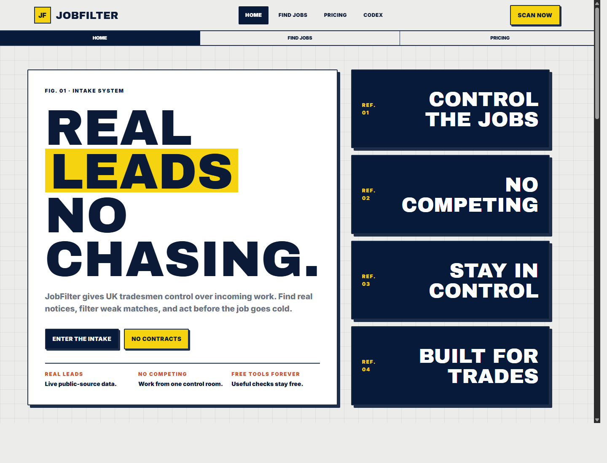

# JobFilter

CURRENT PUBLIC OPPORTUNITIES. CLEAR FIT. CLEAR NEXT ACTION.

JobFilter is a qualification layer for small UK construction and maintenance firms. The current `/find-jobs` procurement path uses Find a Tender OCDS releases and ranks public notices by trade, location evidence, stage, deadline, and buyer context. It does not sell exclusive access or promise an award.

[Live product](https://jobfilter.uk) · [Test scenarios](docs/TEST_SCENARIOS.md)



## Current status

- Live scans may return no result when no verified opportunity matches the trade and patch.
- Internal sample records are blocked from production, even if a runtime toggle is set incorrectly.
- Planning, energy, company, paid checkout, and WhatsApp coverage depend on provider credentials and activation checks; they are not treated as live merely because code exists.
- `/test`, `/test/intake`, `/dev-portal`, and `/api/status` are development-only surfaces and return 404 in production.

### Source readiness

| Readiness | Sources | Customer use |
| --- | --- | --- |
| Live/current | Find a Tender (FTS) OCDS release packages | Primary current-notice scan |
| Legacy/backfill | Contracts Finder | Pre-February-2025 history/transition only; excluded from current scans |
| Experimental | Planning Data, Public Contracts Scotland, Sell2Wales and other unproven adapters | Disabled by default and absent from primary promises |
| Credential-required | EPC, Companies House, Stripe and WhatsApp | Only available after credentials, configuration and live verification |

## What this repository demonstrates

- A Next.js production application with public opportunity ingestion, normalisation, deduplication, scoring, and free/paid response shaping.
- Server-side redaction that keeps buyer, deadline, exact value, action route, and exact scoring depth out of free responses.
- Source health and partial-failure handling: one failed provider does not invent a fallback job or crash the scan.
- Supabase account/data plumbing, Stripe checkout/webhook routes, and Meta WhatsApp delivery code with explicit configuration failures.
- Release gates for dependency security, type safety, lead-quality rules, postcode handling, free-tier privacy, production-only route protection, and a full production build.

## Architecture

```text
Official sources
  -> fetchers
  -> normalise
  -> deduplicate
  -> score and rank
  -> redact by access tier
  -> dashboard / delivery
```

Key areas:

- `leadEngine/` — source registry, fetchers, postcode logic, normalisation, scoring, quality audit, and scan orchestration.
- `server/routes/` — Express-compatible APIs mounted through the Next.js catch-all API route.
- `app/api/` — native Next.js handlers for account, alerts, payments, waitlist, and delivery workflows.
- `src/pages/` and `src/components/` — product UI, scanner, account surfaces, trust pages, and trade landing pages.
- `supabase/migrations/` — versioned database changes and row-level access policies.
- `tests/regression/` — runnable product, privacy, quality, and runtime checks.

## Known limitations

- Source volume and trade/location fit vary with what buyers publish; an empty scan is a valid outcome.
- EPC, Companies House, Stripe pricing, and WhatsApp delivery require provider credentials and live environment verification.
- Public tenders may be pursued by other suppliers; territory routing must never be presented as exclusive notice access.
- The current route surface is larger than the intended flagship journey and still needs product simplification.

## Environment Variables

No API key is required for the live Find a Tender search.

Optional:

```bash
PORT=3000
NODE_ENV=development
NEXT_PUBLIC_SUPABASE_URL=
NEXT_PUBLIC_SUPABASE_ANON_KEY=
SUPABASE_SERVICE_ROLE_KEY=
```

Production data is moving to Supabase:

```text
Run supabase/migrations/20260522_vercel_supabase_saas.sql
Keep SUPABASE_SERVICE_ROLE_KEY server-only.
```

## Install

```bash
npm install
```

## Run Frontend + API Locally

```bash
npm run dev
```

Open:

```text
http://localhost:3000
http://localhost:3000/find-jobs
```

## Build + Test Commands

```bash
npm run lint
npm audit
npx tsx tests/regression/production-source-safety-regression.mjs
npx tsx tests/regression/postcode-filter-regression.mjs
node tests/regression/free-scanner-redaction-regression.mjs
npx tsx tests/regression/lead-engine-quality-regression.mjs
npm run build
node tests/regression/production-runtime-regression.mjs
```

## API

Live lead scanner endpoint:

```text
POST /api/leads/search
```

Request:

```json
{
  "postcode": "B14 7QH",
  "trade": "electrical",
  "radiusMiles": 25
}
```

Response shape:

```json
{
  "ok": true,
  "source": "lead_engine",
  "count": 0,
  "region": "West Midlands",
  "outward": "B14",
  "leads": [],
  "errors": []
}
```

Waitlist endpoint:

```text
POST /api/waitlist
```

```json
{
  "name": "A Tradesman",
  "trade": "Electrician",
  "contact": "name@example.com",
  "source": "site"
}
```

Expected pattern:

```json
{ "ok": true }
```

Intake scoring endpoint:

```text
POST /api/intake/score
```

```json
{
  "jobType": "Plumbing",
  "urgency": "Emergency",
  "postcode": "B14 7QH",
  "phone": "07123456789",
  "details": "Leaking boiler",
  "hasPhotos": true
}
```

## Curl Examples

Success query:

```bash
curl -s -X POST http://localhost:3000/api/leads/search \
  -H "Content-Type: application/json" \
  -d "{\"postcode\":\"B14 7QH\",\"trade\":\"electrical\",\"radiusMiles\":25}"
```

Expected pattern:

```json
{
  "ok": true,
  "source": "lead_engine",
  "count": 1,
  "region": "West Midlands",
  "outward": "B14",
  "leads": [{ "source": "FTS" }],
  "errors": []
}
```

Empty result query:

```bash
curl -s -X POST http://localhost:3000/api/leads/search \
  -H "Content-Type: application/json" \
  -d "{\"postcode\":\"BT1 5GS\",\"trade\":\"roofing\",\"radiusMiles\":10}"
```

Expected pattern:

```json
{
  "ok": true,
  "source": "lead_engine",
  "count": 0,
  "region": "Northern Ireland",
  "outward": "BT1",
  "leads": [],
  "errors": []
}
```

Invalid postcode query:

```bash
curl -s -X POST http://localhost:3000/api/leads/search \
  -H "Content-Type: application/json" \
  -d "{\"postcode\":\"BAD\",\"trade\":\"electrical\",\"radiusMiles\":25}"
```

Expected pattern:

```json
{
  "ok": false,
  "source": "lead_engine",
  "count": 0,
  "region": "",
  "outward": "",
  "leads": [],
  "errors": ["valid UK postcode required"]
}
```

Waitlist:

```bash
curl -s -X POST http://localhost:3000/api/waitlist \
  -H "Content-Type: application/json" \
  -d "{\"name\":\"A Tradesman\",\"trade\":\"Electrician\",\"contact\":\"name@example.com\",\"source\":\"readme\"}"
```

Intake score:

```bash
curl -s -X POST http://localhost:3000/api/intake/score \
  -H "Content-Type: application/json" \
  -d "{\"jobType\":\"Plumbing\",\"urgency\":\"Emergency\",\"postcode\":\"B14 7QH\",\"phone\":\"07123456789\",\"details\":\"Leaking boiler\",\"hasPhotos\":true}"
```

## Routes

```text
/              Home
/find-jobs     Live scanner
/pricing       Pricing
/codex         Technical editorial page
/free-tools    Free quote, job, and diesel tools
/tips          Tips for tradesmen
/vantage       Bid/presentation advantage
/vicinity      Past-work marketing advantage
/privacy       Privacy policy
/terms         Terms
/health        Frontend health page
/api/health    API health JSON
```

## Production Deploy

```bash
npm run lint
npm run test:fts
npm run build
```

Vercel requirements:

- Framework preset: Next.js
- Project root: `JobFilterV1`
- Build command: `npm run build`
- Environment variables from `.env.example`
- Supabase migration applied before production data writes

## Known Limitations

- Radius is currently an intake preference, not a true geospatial distance filter.
- Find a Tender notices do not always include exact delivery postcodes, values, contact details, or eligibility evidence.
- Contracts Finder is retained only for documented legacy/backfill use and is not queried by the current scanner.
- Planning, EPC and other adapters stay outside the primary promise until live coverage and mappings are proven.
